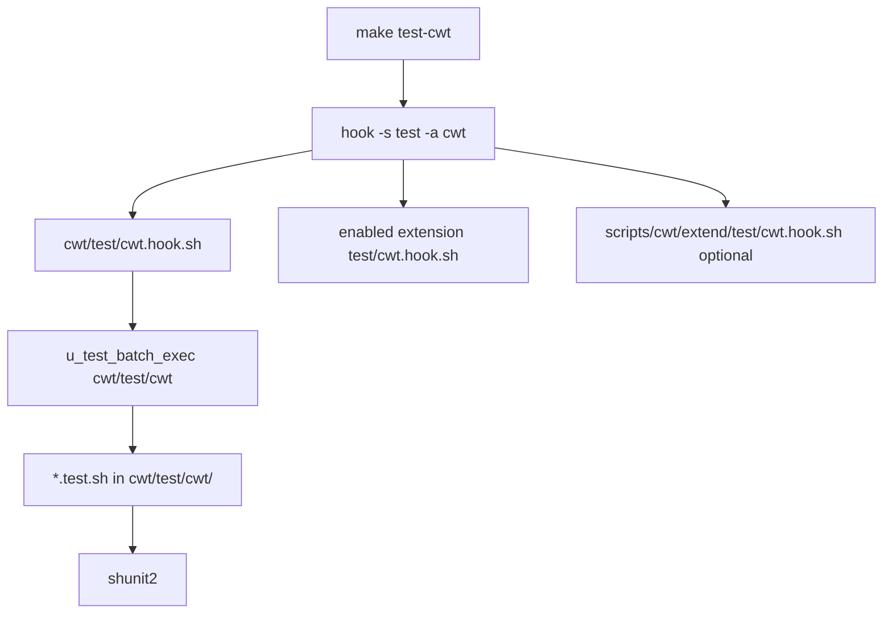

# Testing

## Entry point

```bash
make test-cwt
# Or:
cwt/test/cwt.sh
```

Triggers:

```sh
hook -s 'test' -a 'cwt' -v 'HOST_TYPE PROVISION_USING'
```

(Exact `-v` list may include `HOST_OS` depending on the caller; debug with `make hook-debug s:test a:cwt v:HOST_TYPE PROVISION_USING`.)



Framework: vendored **shunit2** under `cwt/vendor/shunit2`. Helpers: `cwt/test/test.inc.sh`. There is **no** separate `make self-test` shortcut.

## What gets executed

1. **Core batch** — `cwt/test/cwt.hook.sh` → `u_test_batch_exec 'cwt/test/cwt'`
2. **Enabled extensions** — e.g. `cwt/extensions/mysql/test/cwt.hook.sh`, `compose/test/cwt.hook.sh`, `pgsql/…` when those extensions are enabled
3. **Project extend** — optional `scripts/cwt/extend/test/cwt.hook.sh`

## Core cases (also individual make targets)

After `make reinit`, per-case shortcuts are generated into `data/cwt/generated.mk` and registered in `data/cwt/cache/test-cases.sh` (`CWT_TEST_CASE_CACHE`).

| Make target | Script |
|-------------|--------|
| `test-cwt-bootstrap` | `cwt/test/cwt/bootstrap.test.sh` |
| `test-cwt-global` | `global.test.sh` |
| `test-cwt-hook` | `hook.test.sh` |
| `test-cwt-utilities` | `utilities.test.sh` |
| `test-cwt-fsop` | `fsop.test.sh` |
| `test-cwt-wrap` | `wrap.test.sh` |
| `test-cwt-logged-wrappers` | `logged_wrappers.test.sh` |
| `test-cwt-required-programs` | `required_programs.test.sh` |
| `test-cwt-test-results` | `test_results.test.sh` |

`cwt/test/case.run.sh` is the shared **runtime dispatcher** for per-case targets only (not used by the full `test-cwt` hook batch).

## Discovery layouts

`u_test_discover_batch_cases()` looks for a sibling directory named like the batch script without `.sh`:

1. **Flat** — `*.test.sh` in the batch directory
2. **Env subdirs** — `local/`, `preprod/`, `recette/`, `prod/` (`CWT_TEST_CASE_ENVS`)
3. **Manifest** — `.test-cases` listing case stems

## Results archiving

When `CWT_TEST_RESULTS` is not `0` (default: enabled), runs can archive under `${CWT_TEST_RESULTS_ROOT:-data/test-results}`.

## Contributing

1. Add `{extension}/test/cwt.hook.sh` calling `u_test_batch_exec` on a sibling batch dir.
2. Place `*.test.sh` files there.
3. Optionally add a batch action script for a dedicated `make test-<name>` target.
4. `make reinit` then `make test-cwt`.

SoT: `cwt/test/cwt.sh`, `cwt/test/cwt.hook.sh`, `cwt/test/test.inc.sh`, `cwt/make/make.inc.sh`.
